# 목차
- JUnit5 소개
  - JUnit 역사
    - JUnit4, JUnit5 차이점
    - SpockFramework 도 있음. groovy 기반 테스트 프레임워크 (생략해도 됨)
  - JUnit5 사용법 (기본)
    - 어노테이션 목록
      - [Annotations](https://junit.org/junit5/docs/current/user-guide/#writing-tests-annotations)
      - @BeforeEach
      - @AfterEach
      - @BeforeAll
      - @AfterAll
      - @Disabled
      - @Timeout
      - @Tag
      - etc...
    - Assumption API
    - Assertions API
      - [Assertions](https://junit.org/junit5/docs/current/user-guide/#writing-tests-assertions)
    - Assertj
      - [AssertJ](https://assertj.github.io/doc/)
  - JUnit5 ParameterizedTest (매개변수화 테스트)
    - @ValueSource
    - @EnumSource
    - @CsvSource, @CsvFileSource
    - @MethodSource
    - etc...
- Unit Test (단위 테스트)
  - 코드 예시
- Acceptance Test (인수테스트)
  - RestAssured를 이용한 인수테스트
    - 코드 예시
  - MockMvc를 이용한 인수테스트
    - 코드 예시
- Mockito
  - Mockito 소개
  - Mockito 사용법
    - Mocking
    - Stubbing
    - Verification
    - Argument Matchers
    - etc...
- TestContainers
  - Test Container 소개
    - [Test Container](https://www.testcontainers.org/)
  - Test Container 사용법
    - 코드 예시
  - SpringBoot TestContainers 기능 추가
    - [SpringBoot TestContainers](https://docs.spring.io/spring-boot/reference/testing/testcontainers.html)
  - 참고 자료
    - [Tilt](https://tilt.dev/)

# JUnit 소개
- JUnit는 자바 프로그래밍 언어를 위한 인기 있는 단위 테스트 프레임워크입니다. 
- 테스트 주도 개발(TDD)에 중요한 역할을 하며, 시간이 지나면서 크게 발전해 왔습니다.

## JUnit 4
- **출시**: 2006년
- **주요 기능**:
  - **어노테이션**: `@Test`, `@Before`, `@After`, `@BeforeClass`, `@AfterClass`와 같은 어노테이션을 도입하여 테스트 설정 및 해제를 단순화.
  - **유연한 테스트 실행**: 테스트 작성 및 관리의 유연성 향상.
  - **가정**: `Assume`을 사용한 조건부 테스트 건너뛰기 지원.
  - **룰**: `@Rule`을 통한 테스트 메서드의 추가 또는 대체 동작 지원.

## JUnit 5
- **출시**: 2017년
- **모듈형 아키텍처**: 세 가지 하위 프로젝트로 나뉨:
  - **JUnit Platform**: JVM에서 테스트 프레임워크를 실행하기 위한 기반 제공.
  - **JUnit Jupiter**: 새로운 프로그래밍 모델 및 확장 모델로 테스트와 확장 작성.
  - **JUnit Vintage**: JUnit 3 및 JUnit 4 테스트의 호환성을 제공.

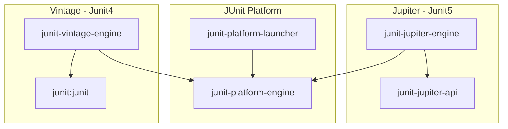

- **주요 기능**:
  - **어노테이션**: 새로운 어노테이션 `@BeforeEach`, `@AfterEach`, `@BeforeAll`, `@AfterAll` 추가.
  - **동적 테스트**: 런타임에 생성될 수 있는 동적 테스트 지원.
  - **매개변수화된 테스트**: `@ParameterizedTest` 어노테이션을 통한 강화된 매개변수화 테스트.
  - **확장**: 더 포괄적인 사용자 정의 및 서드파티 프레임워크와의 통합을 가능하게 하는 유연한 확장 모델.

## JUnit4 vs. JUnit5
[Difference between JUnit 5 an JUnit 4](https://howtodoinjava.com/junit5/junit-5-vs-junit-4/)

## JUnit5 환경 설정
### Gradle (Kotlin)
```kotlin
dependencies { 
    testImplementation("org.junit.jupiter:junit-jupiter:5.10.3")
}

tasks.withType<Test> { 
    useJUnitPlatform()
}
```

### Gradle (Groovy)
```groovy
dependencies {
    testImplementation 'org.junit.jupiter:junit-jupiter:5.10.3'
}

test {
    useJUnitPlatform()
}
```

### Maven
```xml
  <dependencies>
    <dependency>
      <groupId>org.junit.jupiter</groupId>
      <artifactId>junit-jupiter</artifactId>
      <version>5.10.3</version>
      <scope>test</scope>
    </dependency>
  </dependencies>

  <build>
    <plugins>
      <plugin>
        <groupId>org.springframework.boot</groupId>
        <artifactId>maven-surefire-plugin</artifactId>
        <version>3.3.1</version>
      </plugin>
    </plugins>
  </build>
```

## 참고자료
- [JUnit 4 Documentation](https://junit.org/junit4/)
- [JUnit 5 Documentation](https://junit.org/junit5/)

# JUnit5 사용법

## Annotation 목록
[Annotation 목록](https://junit.org/junit5/docs/current/user-guide/#writing-tests-annotations)

### 주로 사용하는 Annotation
- **@Test**
  - **@BeforeEach**
  - **@AfterEach**
  - **@BeforeAll**
  - **@AfterAll**
- **@ParameterizedTest**
  - **@ValueSource**
  - **@EnumSource**
  - **@NullAndEmptySource**
  - **@CsvSource**
    - **@CsvFileSource**
  - **@MethodSource**
  - **@ArgumentsSource**
- **@DisplayName**
- **@RepeatedTest**
- **@Disabled**
- **@Nested**
- **@Timeout**

### 사용하지 않길 권장하는 Annotation
> 테스트 메서드 간 실행 순서 의존과 필드는 공유하지 않는게 좋습니다.
- **@TestMethodOrder**
- **@TestClassOrder**
- **@Order**

## Test Lifecycle
- **@BeforeAll**: 테스트 클래스 내의 모든 테스트 메서드가 실행되기 전에 한 번 실행됩니다.
- **@BeforeEach**: 각 테스트 메서드가 실행되기 전에 실행됩니다.
- **@AfterEach**: 각 테스트 메서드가 실행된 후에 실행됩니다.
- **@AfterAll**: 테스트 클래스 내의 모든 테스트 메서드가 실행된 후에 한 번 실행됩니다.

```java
class JunitLifecycleTest {
    @BeforeAll
    static void beforeAll() {
        System.out.println("Before all");
    }

    @AfterAll
    static void afterAll() {
      System.out.println("After all");
    }
    
    @BeforeEach
    void setUp() {
        System.out.println("Before each");
    }
    
    @AfterEach
    void tearDown() {
      System.out.println("After each");
    }
    
    @Test
    void test1() {
        System.out.println("Test 1");
    }
    
    @Test
    void test2() {
        System.out.println("Test 2");
    }
}

/*
Before all
Before each
Test 1
After each
Before each
Test 2
After each
After all
*/
```

## Assertions
- JUnit5에서는 `org.junit.jupiter.api.Assertions` 클래스를 통해 다양한 Assertion 메서드를 제공합니다.
- 하지만 주로 `assertj` 라이브러리를 사용하는 것이 좋습니다.
  - https://assertj.github.io/doc/#assertj-overview

```java
// 모든 검증을 실행하고, 그중에 실패한 것이 있는지 확인
assertAll(
    () -> assertEquals(4, calculator.add(2, 2)),
    () -> assertEquals(0, calculator.subtract(2, 2)),
    () -> assertEquals(4, calculator.multiply(2, 2)),
    () -> assertEquals(1, calculator.divide(2, 2))
);
```

### 1. 일반적인 Assertion 메서드
<details>
  <summary>펼쳐보기</summary>

- **isEqualTo()**
  ```java
  assertThat(actual).isEqualTo(expected);
  ```
  - 실제 값이 예상 값과 동일한지 확인합니다.

- **isNotEqualTo()**
  ```java
  assertThat(actual).isNotEqualTo(expected);
  ```
  - 실제 값이 예상 값과 다른지 확인합니다.

- **isNull()**
  ```java
  assertThat(actual).isNull();
  ```
  - 실제 값이 null인지 확인합니다.

- **isNotNull()**
  ```java
  assertThat(actual).isNotNull();
  ```
  - 실제 값이 null이 아닌지 확인합니다.

- **isSameAs()**
  ```java
  assertThat(actual).isSameAs(expected);
  ```
  - 실제 값이 예상 값과 같은 객체인지 확인합니다.

- **isNotSameAs()**
  ```java
  assertThat(actual).isNotSameAs(expected);
  ```
  - 실제 값이 예상 값과 다른 객체인지 확인합니다.
</details>

### 2. 숫자 관련 Assertion 메서드
<details>
  <summary>펼쳐보기</summary>

- **isGreaterThan()**
  ```java
  assertThat(actual).isGreaterThan(expected);
  ```
  - 실제 값이 예상 값보다 큰지 확인합니다.

- **isLessThan()**
  ```java
  assertThat(actual).isLessThan(expected);
  ```
  - 실제 값이 예상 값보다 작은지 확인합니다.

- **isBetween()**
  ```java
  assertThat(actual).isBetween(start, end);
  ```
  - 실제 값이 지정된 범위 내에 있는지 확인합니다.
</details>

### 3. 문자열 관련 Assertion 메서드
<details>
  <summary>펼쳐보기</summary>

- **isEmpty()**
  ```java
  assertThat(actual).isEmpty();
  ```
  - 문자열이 비어 있는지 확인합니다.

- **isNotEmpty()**
  ```java
  assertThat(actual).isNotEmpty();
  ```
  - 문자열이 비어 있지 않은지 확인합니다.

- **isBlank()**
  ```java
  assertThat(actual).isBlank();
  ```
  - 문자열이 비어 있거나 공백인지 확인합니다.

- **isNotBlank()**
  ```java
  assertThat(actual).isNotBlank();
  ```
  - 문자열이 비어 있지 않고 공백이 아닌지 확인합니다.

- **contains()**
  ```java
  assertThat(actual).contains(substring);
  ```
  - 문자열이 특정 하위 문자열을 포함하는지 확인합니다.

- **doesNotContain()**
  ```java
  assertThat(actual).doesNotContain(substring);
  ```
  - 문자열이 특정 하위 문자열을 포함하지 않는지 확인합니다.

- **startsWith()**
  ```java
  assertThat(actual).startsWith(prefix);
  ```
  - 문자열이 특정 접두사로 시작하는지 확인합니다.

- **endsWith()**
  ```java
  assertThat(actual).endsWith(suffix);
  ```
  - 문자열이 특정 접미사로 끝나는지 확인합니다.
</details>

### 4. 리스트 및 배열 관련 Assertion 메서드
<details>
  <summary>펼쳐보기</summary>

- **isEmpty()**
  ```java
  assertThat(actual).isEmpty();
  ```
  - 리스트나 배열이 비어 있는지 확인합니다.

- **isNotEmpty()**
  ```java
  assertThat(actual).isNotEmpty();
  ```
  - 리스트나 배열이 비어 있지 않은지 확인합니다.

- **contains()**
  ```java
  assertThat(actual).contains(element);
  ```
  - 리스트나 배열이 특정 요소를 포함하는지 확인합니다.

- **containsExactly()**
  ```java
  assertThat(actual).containsExactly(elements);
  ```
  - 리스트나 배열이 정확히 지정된 요소들을 포함하고 순서도 일치하는지 확인합니다.

- **containsExactlyInAnyOrder()**
  ```java
  assertThat(actual).containsExactlyInAnyOrder(elements);
  ```
  - 리스트나 배열이 정확히 지정된 요소들을 포함하지만 순서는 상관없는지 확인합니다.

- **containsAnyOf()**
  ```java
  assertThat(actual).containsAnyOf(elements);
  ```
  - 리스트나 배열이 지정된 요소들 중 하나라도 포함하는지 확인합니다.

- **doesNotContain()**
  ```java
  assertThat(actual).doesNotContain(elements);
  ```
  - 리스트나 배열이 지정된 요소들을 포함하지 않는지 확인합니다.
</details>

### 5. 예외 관련 Assertion 메서드
<details>
  <summary>펼쳐보기</summary>

- **assertThatTypeOfException()**
  ```java
  assertThatExceptionOfType(ArithmeticException.class)
    .isThrownBy(() -> Calculator.plus(Integer.MAX_VALUE, 1));
  ```

- **hasMessage()**
  ```java
  assertThatThrownBy(() -> {
      // code that throws exception
  }).hasMessage(expectedMessage);
  ```
  - 예외가 특정 메시지를 포함하는지 확인합니다.

- **isInstanceOf()**
  ```java
  assertThatThrownBy(() -> {
      // code that throws exception
  }).isInstanceOf(ExceptionClass.class);
  ```
  - 예외가 특정 클래스의 인스턴스인지 확인합니다.
</details>

## @ParameterizedTest
[코드 예시](./src/test/java/com/example/tdd/parameterized/ParameterizedTestClassTest.java)

<details>
  <summary>펼쳐보기</summary>

### 1. @ValueSource
```java
import org.junit.jupiter.params.ParameterizedTest;
import org.junit.jupiter.params.provider.ValueSource;
import static org.junit.jupiter.api.Assertions.assertTrue;

public class ValueSourceTest {

    @ParameterizedTest
    @ValueSource(strings = {"racecar", "radar", "able was I ere I saw elba"})
    void palindromes(String candidate) {
        assertTrue(isPalindrome(candidate));
    }

    private boolean isPalindrome(String candidate) {
        return candidate.contentEquals(new StringBuilder(candidate).reverse());
    }
}
```

### 2. @EnumSource
```java
import org.junit.jupiter.params.ParameterizedTest;
import org.junit.jupiter.params.provider.EnumSource;
import static org.junit.jupiter.api.Assertions.assertNotNull;

public class EnumSourceTest {

    enum Topping { HAM, MUSHROOM, ONION, PEPPER, SAUSAGE }

    @ParameterizedTest
    @EnumSource(Topping.class)
    void testEnumSource(Topping topping) {
        assertNotNull(topping);
    }
}
```

### 3. @NullAndEmptySource
```java
import org.junit.jupiter.params.ParameterizedTest;
import org.junit.jupiter.params.provider.NullAndEmptySource;
import static org.junit.jupiter.api.Assertions.assertTrue;

public class NullAndEmptySourceTest {

    @ParameterizedTest
    @NullAndEmptySource
    void nullAndEmptyStrings(String text) {
        assertTrue(text == null || text.isEmpty());
    }
}
```

### 4. @CsvSource
```java
import org.junit.jupiter.params.ParameterizedTest;
import org.junit.jupiter.params.provider.CsvSource;
import static org.junit.jupiter.api.Assertions.assertEquals;

public class CsvSourceTest {

    @ParameterizedTest
    @CsvSource({
        "test, TEST",
        "tEst, TEST",
        "Java, JAVA"
    })
    void toUpperCase_ShouldGenerateTheExpectedUpperCaseValue(String input, String expected) {
        assertEquals(expected, input.toUpperCase());
    }
}
```

### 5. @CsvFileSource
```java
import org.junit.jupiter.params.ParameterizedTest;
import org.junit.jupiter.params.provider.CsvFileSource;
import static org.junit.jupiter.api.Assertions.assertEquals;

public class CsvFileSourceTest {

    @ParameterizedTest
    @CsvFileSource(resources = "/test-data.csv", numLinesToSkip = 1)
    void toUpperCase_ShouldGenerateTheExpectedUpperCaseValue(String input, String expected) {
        assertEquals(expected, input.toUpperCase());
    }
}
```

### 6. @MethodSource
```java
import org.junit.jupiter.params.ParameterizedTest;
import org.junit.jupiter.params.provider.MethodSource;
import static org.junit.jupiter.api.Assertions.assertEquals;
import java.util.stream.Stream;

public class MethodSourceTest {

    @ParameterizedTest
    @MethodSource("stringProvider")
    void testWithStringProvider(String argument) {
        assertNotNull(argument);
    }

    static Stream<String> stringProvider() {
        return Stream.of("apple", "banana");
    }
}
```

### 7. @ArgumentsSource
```java
import org.junit.jupiter.params.ParameterizedTest;
import org.junit.jupiter.params.provider.ArgumentsSource;
import org.junit.jupiter.params.provider.Arguments;
import org.junit.jupiter.params.provider.ArgumentsProvider;
import static org.junit.jupiter.api.Assertions.assertEquals;
import java.util.stream.Stream;

public class ArgumentsSourceTest {

    @ParameterizedTest
    @ArgumentsSource(CustomArgumentsProvider.class)
    void testWithArgumentsSource(String argument) {
        assertNotNull(argument);
    }

    static class CustomArgumentsProvider implements ArgumentsProvider {
        @Override
        public Stream<? extends Arguments> provideArguments(ExtensionContext context) {
            return Stream.of("apple", "banana").map(Arguments::of);
        }
    }
}
```

</details>

## Mockito (Test Double)
- `Stub`
  - 구현을 테스트에 맞게 단순하게 대체하는 것
- `Fake`
  - 실제 동작하는 구현을 제공
  - 제품에는 적합하지 않음
    - ex) DB 대신에 메모리를 통한 구현
- `Spy`
  - 호출된 내역을 기록한다.
- `Mock`
  - `Stub` + `Spy`
  - 기대한 대로 상호작용하는지 행위를 검증한다.

### Mockito 사용법
> `spring-boot-starter-test` 에 기본적으로 포함되어 있습니다.
> 
> [Mockito Javadoc](https://javadoc.io/static/org.mockito/mockito-core/5.12.0/org/mockito/Mockito.html)
>
> [Mockito 코드 예시](https://github.com/mockito/mockito/wiki#examples)

- maven
  ```xml
  <!-- https://mvnrepository.com/artifact/org.mockito/mockito-core -->
  <dependency>
      <groupId>org.mockito</groupId>
      <artifactId>mockito-core</artifactId>
      <version>5.12.0</version>
      <scope>test</scope>
  </dependency>
  ```
- gradle (groovy)
  ```groovy
  dependencies {
      // https://mvnrepository.com/artifact/org.mockito/mockito-core
      testImplementation 'org.mockito:mockito-core:5.12.0'
  }
  ```
- gradle (kotlin)
  ```kotlin
  dependencies { 
      // https://mvnrepository.com/artifact/org.mockito/mockito-core
      testImplementation("org.mockito:mockito-core:5.12.0")
  }
  ```

#### 1. `Function<T, R>`을 정상 리턴 값을 mocking 하기

<details>
  <summary>펼쳐보기</summary>
  
```java
@Test
void mockTest_By_BDDMockito_given_method() {
    given(gameNumGenMock.generate(GameLevel.EASY)).willReturn("123");

    String gameNumber = gameNumGenMock.generate(GameLevel.EASY);

    assertThat(gameNumber).isEqualTo("123");
}

@Test
void mockTest_By_Mockito_when_method() {
    when(gameNumGenMock.generate(eq(GameLevel.EASY))).thenReturn("123");

    String gameNumber = gameNumGenMock.generate(GameLevel.EASY);

    assertThat(gameNumber).isEqualTo("123");
}
```

</details>

#### 2. `Function<T, R>`을 예외 throwing을 mocking 하기

<details>
  <summary>펼쳐보기</summary>

```java
@Test
void mockThrowTest_By_BDDMockito_given_method() {
  GameNumGen gameNumGenMock = mock(GameNumGen.class);

  given(gameNumGenMock.generate(GameLevel.EASY)).willThrow(IllegalArgumentException.class);
  assertThatExceptionOfType(IllegalArgumentException.class)
          .isThrownBy(() -> gameNumGenMock.generate(GameLevel.EASY));
}

@Test
void mockThrowTest_By_Mockito_when_method() {
  GameNumGen gameNumGenMock = mock(GameNumGen.class);

  when(gameNumGenMock.generate(eq(GameLevel.EASY))).thenThrow(IllegalArgumentException.class);

  assertThatExceptionOfType(IllegalArgumentException.class)
          .isThrownBy(() -> gameNumGenMock.generate(GameLevel.EASY));
}
```

</details>

#### 3. `Function<T, Void>`을 정상 작동 mocking 하기
참고: [Mocking Void Methods with Mockito](https://www.baeldung.com/mockito-void-methods)

<details>
  <summary>펼쳐보기</summary>

```java
@Test
void mockNothing_Test_void_method_By_BDDMockito() {
    List<String> mockList = mock(List.class);

    willDoNothing().given(mockList).clear();

    assertThatNoException().isThrownBy(mockList::clear);
}

@Test
void mockNothing_Test_void_method_By_Mockito_doThrow_or_doNothing() {
    List<String> mockList = mock(List.class);

    doNothing().when(mockList).clear();

    assertThatNoException().isThrownBy(mockList::clear);
}
```

</details>

#### 4. `Function<T, Void>`을 예외 throwing을 mocking 하기

<details>
  <summary>펼쳐보기</summary>

```java
@Test
void mockThrowTest_void_method_By_BDDMockito() {
    List<String> mockList = mock(List.class);

    willThrow(UnsupportedOperationException.class)
        .given(mockList)
        .clear();

    assertThatExceptionOfType(UnsupportedOperationException.class)
        .isThrownBy(mockList::clear);
}

@Test
void mockThrowTest_void_method_By_Mockito_doThrow_or_doNothing() {
    List<String> mockList = mock(List.class);

    doThrow(UnsupportedOperationException.class)
        .when(mockList)
        .clear();

    assertThatExceptionOfType(UnsupportedOperationException.class)
        .isThrownBy(mockList::clear);
}
```

</details>

### ArgumentMatchers
- [코드 예시](./src/test/java/com/example/tdd/mockito/ArgumentMatcherTest.java)
- `anyInt()`, `anyShort()`, `anyLong()`, `anyByte()`, `anyChar()`, `anyDouble()`, `anyFloat()`, `anyBoolean()`
- `anyString()`
- `any()`
- `anyList()`, `anySet()`, `anyMap()`, `anyCollection()`
- `eq(value)`

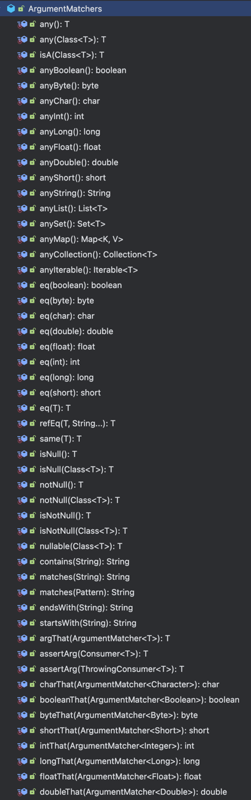

### Verify (Then)
- [코드 예시](./src/test/java/com/example/tdd/mockito/VerificationTest.java)

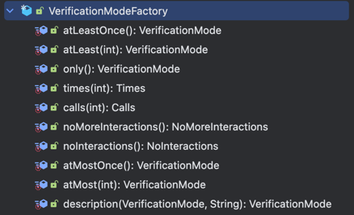


<details>
  <summary>(참고) `times` vs `calls`</summary>

`Mockito`에서 `calls`와 `times` 메서드는 모두 메서드 호출 횟수를 검증하는 데 사용되지만, 사용하는 방식과 목적에 따라 차이가 있습니다.

##### 1. `times(int wantedNumberOfInvocations)`
- **설명**: `times`는 특정 메서드가 특정 횟수만큼 호출되었는지를 검증할 때 사용됩니다.
- **사용 예시**:
  ```java
  // 예시 메서드 호출
  mockedList.add("one");
  mockedList.add("two");
  mockedList.add("two");

  // 검증: add("one")이 한 번 호출되었는지 확인
  verify(mockedList, times(1)).add("one");

  // 검증: add("two")가 두 번 호출되었는지 확인
  verify(mockedList, times(2)).add("two");

  // 검증: add("three")가 한 번도 호출되지 않았는지 확인
  verify(mockedList, times(0)).add("three");
  ```

- **주요 특징**:
  - `times`는 특정 메서드가 명시된 횟수만큼 호출되었는지를 검증하는 데 사용됩니다.
  - 주로 호출 횟수를 엄격하게 검증하고자 할 때 사용됩니다.

##### 2. `calls(int wantedNumberOfCalls)`
- **설명**: `calls`는 주로 `InOrder`와 같이 메서드 호출 순서를 검증할 때 사용됩니다. 이 메서드는 특정 메서드가 지정된 횟수만큼 호출되었는지 검증합니다.
- **사용 예시**:
  ```java
  // InOrder 객체 생성
  InOrder inOrder = inOrder(mockedList);

  // 예시 메서드 호출
  mockedList.add("one");
  mockedList.add("two");
  mockedList.add("three");

  // 검증: 순서대로 "one", "two", "three"가 각각 한 번씩 호출되었는지 확인
  inOrder.verify(mockedList, calls(1)).add("one");
  inOrder.verify(mockedList, calls(1)).add("two");
  inOrder.verify(mockedList, calls(1)).add("three");
  ```

- **주요 특징**:
  - `calls`는 `InOrder`와 함께 사용되어, 메서드 호출의 순서를 검증하면서 호출 횟수도 동시에 검증할 수 있습니다.
  - 순서를 중시하는 테스트에서 유용하게 사용됩니다.
  - `times`와 달리, 주로 `InOrder.verify()`와 함께 사용됩니다.

##### 요약
- **`times`**: 특정 메서드가 지정된 횟수만큼 호출되었는지 검증하는 데 사용됩니다. 일반적인 호출 횟수 검증에 사용됩니다.
- **`calls`**: 메서드 호출 순서와 호출 횟수를 동시에 검증할 때, 특히 `InOrder`와 함께 사용됩니다.

</details>

### ArgumentCaptor
- [코드 예시](./src/test/java/com/example/tdd/mockito/ArgumentCaptorTest.java)
- `ArgumentCaptor.capture()` 혹은 `ArgumentCaptor.forClass(String.class)`를 사용하여 메서드 호출 시 전달된 인자를 캡처할 수 있습니다.
  - **verify 코드에서 인자로 전달** 

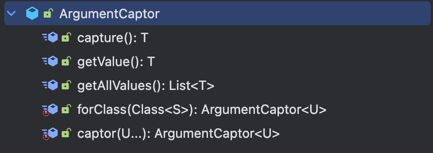

### mockito-junit-jupiter (MockitoExtension)
- `org.mockito:mockito-junit-jupiter:5.12.0` 라이브러리 적용
- `@ExtendWith(MockitoExtension.class)`, `@Mock` 어노테이션으로 자동으로 모의 객체 생성

```java
@ExtendWith(MockitoExtension.class)
class MockitoExtensionTest {

    @Mock
    private List<String> mockedList;

    @Test
    void test() {
        mockedList.add("one");
        verify(mockedList).add("one");
    }
}
```

# 단위 테스트, 통합 테스트, E2E 테스트

- **E2E 테스트(End-to-End Test)**, **인수 테스트(Acceptance Test)**
  - 사용자 입장에서 시스템이 제공하는 기능이 올바르게 동작하는지 확인
  - 사용자가 직접 사용하는 웹 브라우저나 모바일 App을 통해 테스트
    - 주로 QA(Quality Assurance)팀이 수행
- **통합 테스트(Integration Test)**
  - 시스템의 각 구성 요소가 올바르게 연동되는지 확인
    - DB, Message Queue, REST API, 외부 서비스
  - E2E 테스트와 달리, 소프트웨어 코드를 직접 테스트
- **단위 테스트(Unit Test)**
  - 개별 코드나 컴포넌트가 계획한대로 동작하는지 확인
  - 클래스나 메서드 단위로 테스트
  - 일부 의존 대상은 Mocking을 통해 대체

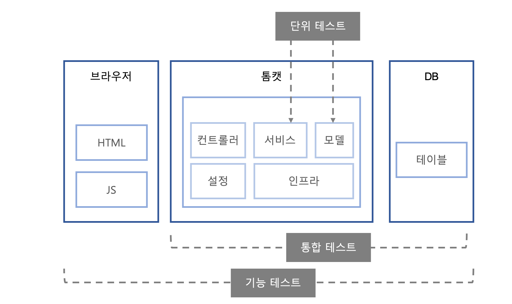

## 테스트 피라미드(Test Pyramid)
- 가능하면 단위 테스트에서 다양한 상황을 다루고, (예외 상황 포함) 
- 통합 테스트, E2E 테스트는 주요 핵심 기능 상황에 초점을 맞추는 것이 좋습니다.

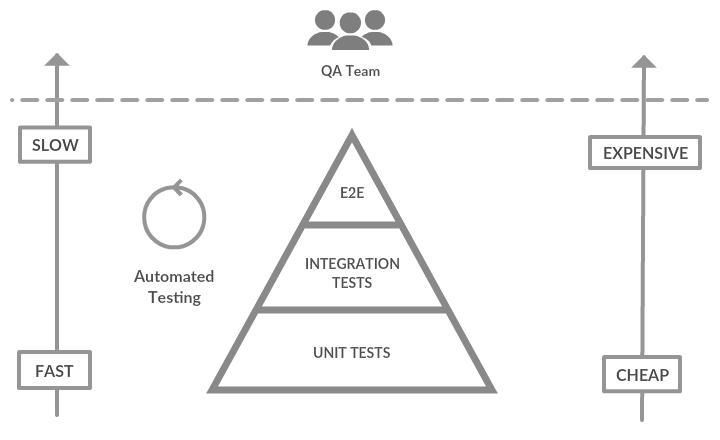

# TDD
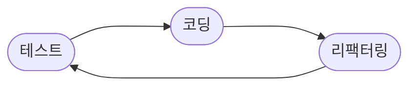

## 테스트 코드 Tip
### 변수나 필드를 사용해서 기댓값 표현하지 않기

### 두 개 이상 검증하지 않기
- 검증 대상이 명확하게 구분된다면, 테스트 메서드도 구분하는 것이 좋다.
- 
### 모의 객체 설정할 때, ArgumentMatcher 적극 활용하기

### 과도하게 내부 구현 검증하지 않기!
- Mockito 사용에 대한 모순점
  - 모의 객체 메서드 호출 검증을 많이 하면,
  - 내부 구현을 조금만 변경해도 테스트가 깨질 가능성이 커진다.
- 테스트 코드는 내부 구현보다 실행 결과를 검증해야 한다.
- 하지만, 실행 결과를 확인하는 것이 어려운 경우, 모의 객체 메서드 호출 검증을 사용할 수 있다.
  - 추후 리팩터링을 통해 해당 부분을 개선하는 것이 좋다.

### 중복된 테스트 상황 설정을 `@BeforEach`에 넣지 않기
- 각 테스트 메서드가 독립적으로 실행되어야 한다.
- 각 테스트 코드는 독립적으로 `given - when - then`을 수행해야 한다.
  - `@BeforeEach`에 공통적인 상황 설정을 넣으면, 테스트 코드 간 의존성이 생길 수 있다.

### 데이터 공유 주의하기
- 모든 테스트가 같은 값을 사용하는 데이터
  - (예시) 코드값 데이터, 메타 데이터
- 테스트 메서드에서만 필요한 데이터
  - (예시) 중복 ID 검사를 위한 회원 데이터

### 통합 테스트의 상황 설정을 위한 보조 클래스 사용하기
- Step Class 활용

### 실행 시점이 다르다고 해서 실패하지 않기
- `LocalDateTime.now()` 등의 실행 시점에 따라 결과가 달라지는 코드는 테스트하기 어렵다.
  - 파라미터로 받거나, 별도의 시간 클래스를 만들어서 사용하는 것이 좋다.

### 랜덤하게 실패하지 않기
- 랜덤하게 값을 생성하는 위임 객체를 만들어서 사용하면, mocking 테스트가 가능해진다.

### 테스트를 위한 도메인 객체 생성 팩토리 클래스 활용하기
- 테스트 코드에서 도메인 객체를 생성할 때, 생성자를 직접 호출하는 것보다 팩토리 클래스를 사용하는 것이 좋다.
  - Factory 패턴 활용
  - Builder 패턴 활용
  - Kotlin 파라미터 기본값 활용

### 조건부로 검증(Assertion) 하지 않기
- `if` 문을 사용해서 검증을 하지 않는다.
- 해당 조건 자체도 검증해야 한다.

## Intellij Tip
- `Cmd(Ctrl) + Shift + T`: 테스트 클래스 생성
- `@Tag` 활용
  - [참고 코드](./src/test/java/com/example/tdd/tag/TagAnnotationTest.java)
  - [gradle task 등록](./build.gradle.kts)
    ```kotlin
    tasks.register<Test>("unitTest") {
      description = "Run unit tests"
      group = "verification"

      useJUnitPlatform {
        includeTags("unitTest")
      }
    }
    ```
    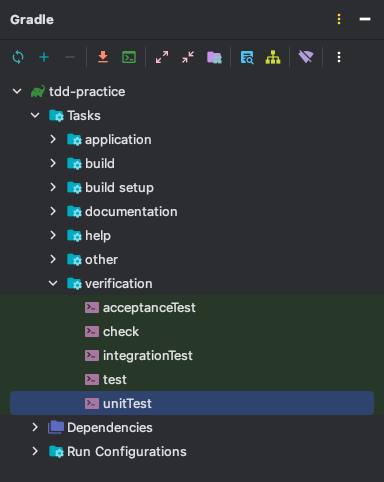    

  - Intellij에서 `unitTest` task 실행
    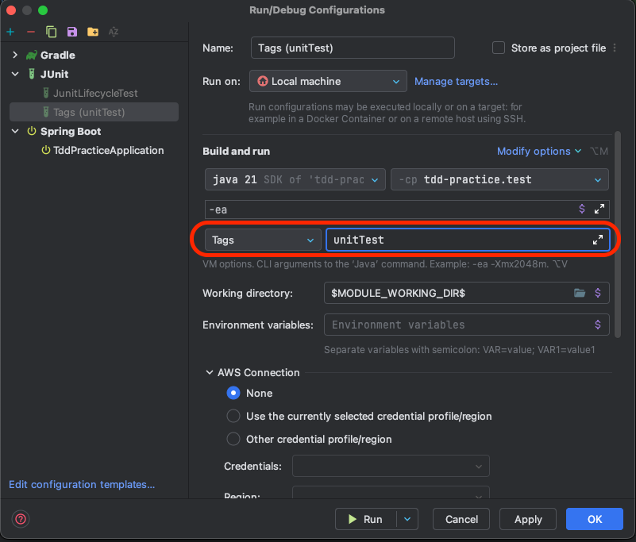
- live template 활용
  - SWDC 컨플루언스 페이지 참조

# ATDD
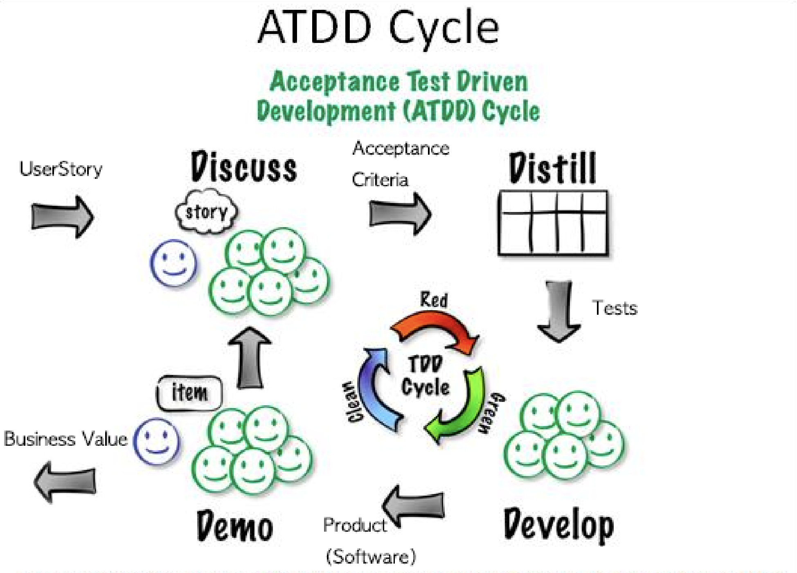
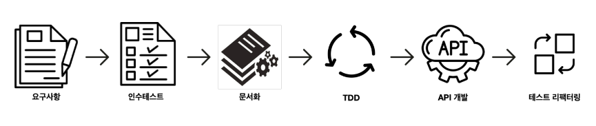

# 최근 추가된 테스트 관련 라이브러리
## TestContainer
> TestContainers는 통합 테스트를 위해 Docker 컨테이너를 손쉽게 사용할 수 있도록 지원하는 Java 라이브러리입니다. <br/>
> 이 라이브러리를 사용하면, 테스트 환경에서 실제 데이터베이스, 메시지 브로커, 웹 서버 등 다양한 Docker 컨테이너를 시작하고 관리할 수 있습니다. <br/> 
> TestContainers는 개발자와 테스트 엔지니어가 보다 현실적인 테스트 환경을 구축할 수 있도록 도와줍니다.

- [TestContainer](https://www.testcontainers.org/)
- [Test-Container-Example](https://github.com/rolroralra/test-container-tutorial)
- [SpringBoot Docs - TestContainer](https://docs.spring.io/spring-boot/reference/testing/testcontainers.html)

## WireMock
> WireMock은 Java 기반의 API 모킹(Mock) 도구로, HTTP(S) 기반의 API를 모방하여 테스트 환경에서 실제 서버와의 통신 없이도 API 호출을 테스트할 수 있게 해줍니다. <br/>
> 이를 통해 개발자나 테스트 엔지니어는 외부 서비스와의 통신을 모의(Mock)하여 애플리케이션의 동작을 검증할 수 있습니다.

- [WireMock](http://wiremock.org/)
- [WireMock-Example](https://github.com/rolroralra/hello-wiremock)

## Tilt
> Tilt는 개발자가 쿠버네티스(Kubernetes) 클러스터에서 애플리케이션을 빠르고 효율적으로 개발, 테스트, 배포할 수 있도록 도와주는 도구입니다.<br/>
> <br/> 
> Tilt는 로컬 개발 환경에서 쿠버네티스를 쉽게 사용할 수 있게 하며, <br/>
> 컨테이너 빌드, 로깅, 코드 변경 모니터링 등을 자동화하여 <br/>
> 개발자가 애플리케이션을 반복적으로 빌드하고 배포하는 과정을 단순화합니다.

- [Tilt](https://tilt.dev/)

## SpringBoot Docker-Compose Support
- [SpringBoot Docker-Compose Support](https://spring.io/blog/2021/10/07/spring-boot-docker-compose-support)

## Awaitility
- [Awaitility](http://www.awaitility.org/)  

# 참고 서적
- [테스트 주도 개발 시작하기](https://product.kyobobook.co.kr/detail/S000001248962)
- [테스트 주도 개발 - 켄트 백](https://product.kyobobook.co.kr/detail/S000001032985)
- [테스트 주도 개발로 배우는 객체 지향 설계와 실천](https://product.kyobobook.co.kr/detail/S000001032969)
- [린 애자일 기법을 활용한 테스트 주도 개발](https://product.kyobobook.co.kr/detail/S000000935574)
- [레거시 코드 활용 전략](https://product.kyobobook.co.kr/detail/S000001804724)